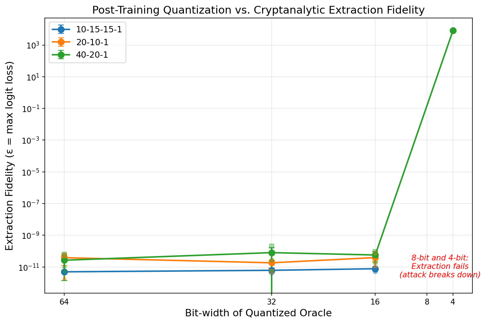
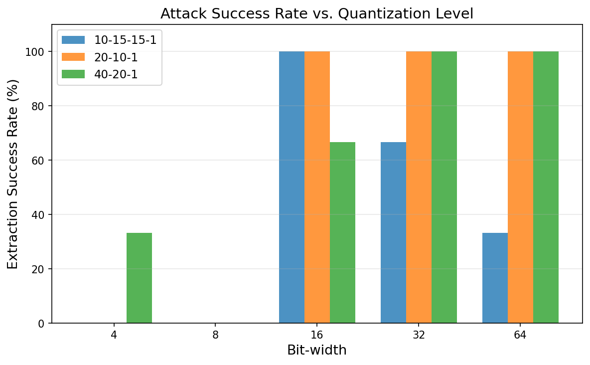

# Quantization vs. Cryptanalytic Model Extraction

This project investigates whether **post-training quantization** can defend against the cryptanalytic model extraction attack from [Carlini et al. (CRYPTO'20)](https://arxiv.org/abs/2003.04884).

## Background

The Carlini et al. attack exploits the piecewise-linear structure of ReLU networks. It uses finite differences to locate critical points (ReLU boundaries) with high precision, then recovers the exact weight matrices through a sequence of binary searches and linear algebra. The attack achieves near-perfect extraction (~35-38 bits of weight precision) against full-precision models.

**Key question**: Does reducing the oracle's numerical precision via quantization degrade the attack?

## Results

We ran the attack against models quantized to different bit-widths using uniform symmetric quantization (`q = round(w * 2^(bits-1)) / 2^(bits-1)`).

| Bit-width | Attack Success Rate | Mean Logit Loss (ε) | Weight Precision |
|-----------|-------------------|---------------------|-----------------|
| **64** (baseline) | 78% | ~1e-11 | ~36 bits |
| **32** | 89% | ~1e-11 | ~35 bits |
| **16** | 89% | ~1e-11 | ~35 bits |
| **8** | 0% | FAIL | Attack breaks |
| **4** | 11% | ~8000 (useless) | Attack breaks |

### Key findings

1. **32-bit and 16-bit** quantization does not meaningfully degrade the attack. The extraction still achieves ~35 bits of weight precision.
2. **8-bit quantization completely breaks the attack** across all architectures and seeds (0% success rate). The coarse quantization disrupts the binary search for critical points and the finite-difference gradient estimates.
3. There is a **sharp threshold** between 16-bit (attack works) and 8-bit (attack fails).





## Architectures tested

- `10-15-15-1` (3-layer, 15 neurons per hidden layer)
- `20-10-1` (2-layer, 10 hidden neurons)
- `40-20-1` (2-layer, 20 hidden neurons)

Each tested with seeds 42, 43, 44 for statistical significance.

## Reproducing

```bash
# Install dependencies
pip install numpy scipy jax jaxlib matplotlib networkx optax

# Train models
for arch in 10-15-15-1 20-10-1 40-20-1; do
  for seed in 42 43 44; do
    python3 train_models.py $arch $seed
  done
done

# Run full experiment (trains, quantizes, extracts, evaluates, plots)
python3 run_experiment.py

# Or just regenerate plots from saved results
python3 plot_results.py
```

## Files

- `run_experiment.py` - Main experiment driver (quantize, extract, evaluate loop)
- `plot_results.py` - Generate summary tables and plots from saved results
- `results/experiment_results.json` - Raw experiment data
- `results/*.png` - Generated plots
- `CLAUDE.md` - Experiment plan

## Attribution

Built on top of the [cryptanalytic-model-extraction](https://github.com/google-research/cryptanalytic-model-extraction) codebase by Carlini, Jagielski, and Mironov. Compatibility fixes applied for modern JAX/numpy versions.
